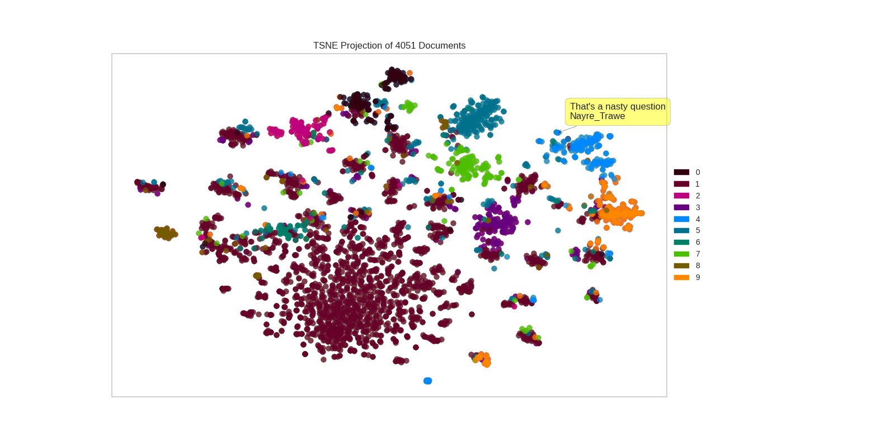

### Visual Reddit Threads with some NLP

Converts a reddit thread ID to:
- t-SNE plots of comments.
- Comment token distributions.

See [examples](/examples).


### Installation
Install the package with:
```python
pip install git+https://github.com/AndriyMulyar/reddit_visualizer
```
and install a custom version of yellowbrick with:
```python
pip install git+https://github.com/AndriyMulyar/yellowbrick@develop
```
Given a reddit thread url and api account downloads the entire thread and visualizes it.


### Instructions
