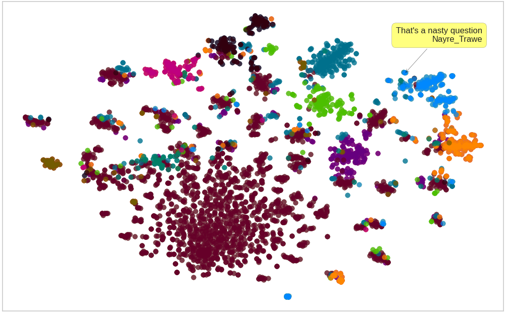

### Visual Reddit Threads with some NLP

Converts a reddit thread ID to:
- interactive t-SNE plots of comments.
- Plots of various comment statistics (user counts, token statistics, etc).

See [examples](/examples).

### Installation
Install the package with:
```python
pip install git+https://github.com/AndriyMulyar/reddit_visualizer
```
and install a custom version of yellowbrick with:
```python
pip install git+https://github.com/AndriyMulyar/yellowbrick@develop
```

### Instructions
